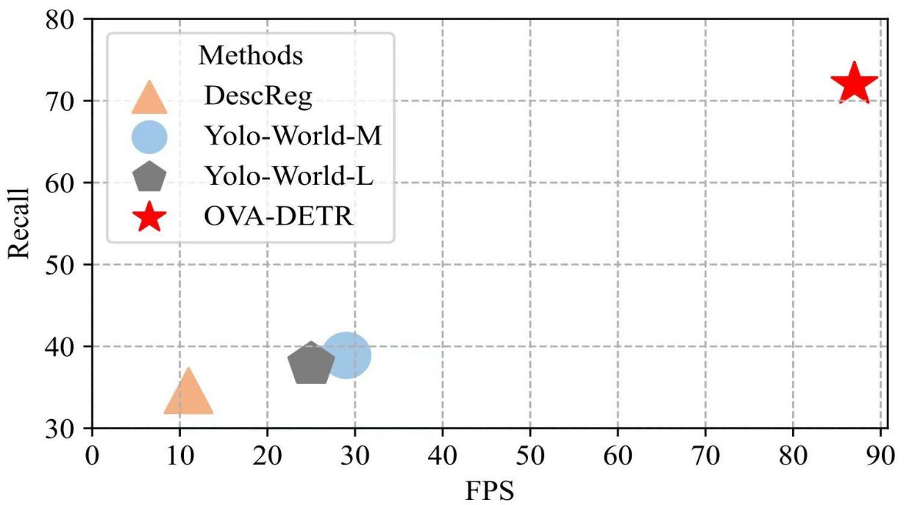
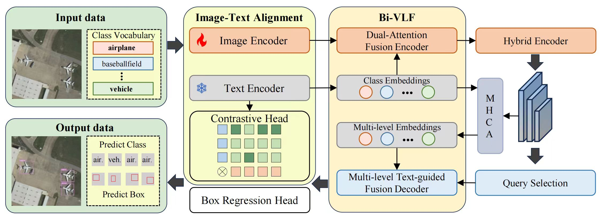
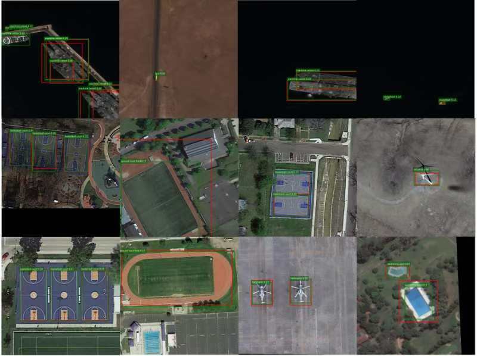

  <h1 style="font-size: 48px; margin: 0;">OVA-DETR</h1>
  
Open Vocabulary Aerial Object Detection Using Image-Text Alignment and Fusion

 
<a href="https://arxiv.org/search/cs?searchtype=author&query=Wei,+G">Guoting Wei</a>1,4,*, 
<a href="https://arxiv.org/search/cs?searchtype=author&query=Yuan,+X">Xia Yuan</a>1,*,
<a href="https://arxiv.org/search/cs?searchtype=author&query=Liu,+Y">Yu Liu</a>3,🌟,
<a href="https://arxiv.org/search/cs?searchtype=author&query=Shang,+Z"> Zhenhao Shangu</a>2,
<a href="https://arxiv.org/search/cs?searchtype=author&query=Yao,+K">Kelu Yao</a>3,
<a href="https://arxiv.org/search/cs?searchtype=author&query=Li,+C">Chao Li</a>3
<a href="https://arxiv.org/search/cs?searchtype=author&query=Yan,+Q">Qingsen Yan</a>2
<a href="https://arxiv.org/search/cs?searchtype=author&query=Zhao,+C">Chunxia Zhao</a>1
<a href="https://arxiv.org/search/cs?searchtype=author&query=Zhang,+H">Haokui Zhang</a>2,🌟,4
<a href="https://arxiv.org/search/cs?searchtype=author&query=Xiao,+R">Rong Xiao</a>4
 

\* Equal contribution 🌟 Project lead 📧 Corresponding author

1 Nanjing University of Science and Technology,  3 Zhejiang Lab

2 Northwestern Polytechnical University, 4Intellifusion

This repository contains the official implementation of [OVA-DETR](https://arxiv.org/abs/2408.12246)

**[OVA-DETR: Open Vocabulary Aerial Object Detection Using Image-Text Alignment and Fusion](https://arxiv.org/abs/2408.12246)**

## Partial results

Figure 1: 

Compared OVA-DETR with recently advanced open-vocabulary detectors in terms of speed and recall. All methods are evaluated on DIOR dataset under zero shot detection. The inference speeds were measured on a 3090 GPU by default, except that DescReg was measured on a 4090 GPU

Figure 2: 

Overall architecture of OVA-DETR.The improvements of OVA-DETR can be summarized into two main components: the Image-Text Alignment and the Bidirectional Vision-Language Fusion.

Figure 5: 

Qualitative results for zero-shot detection on the xView,DIOR,and DOTA datasets, focusing on novel classes.The green rectangles represent predicted bounding boxes, while red rectangles denote ground truth bounding boxes.

 
